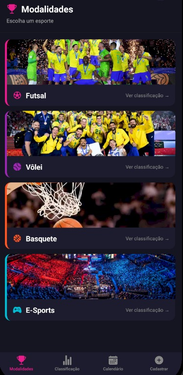
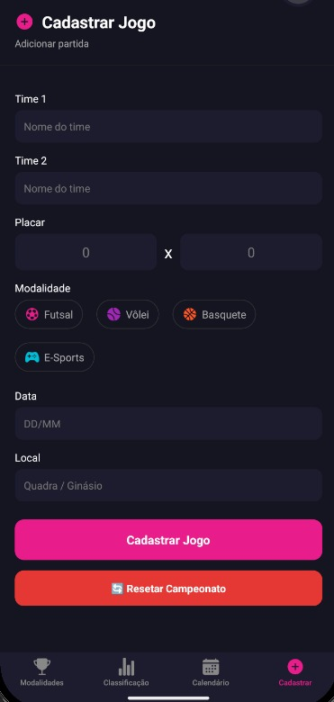
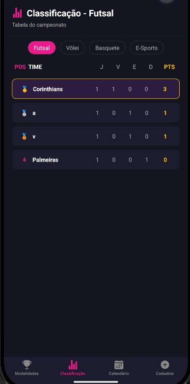
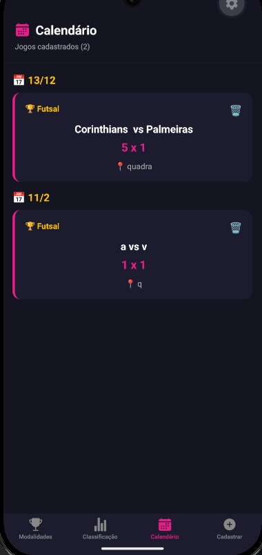
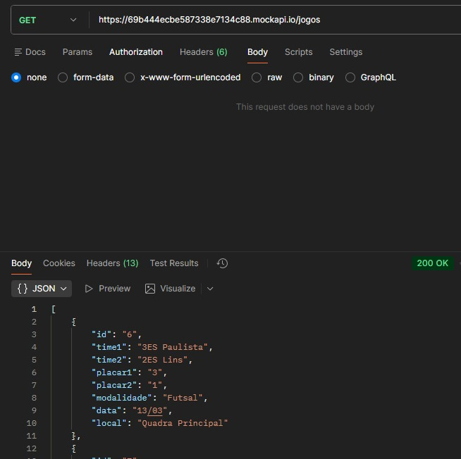
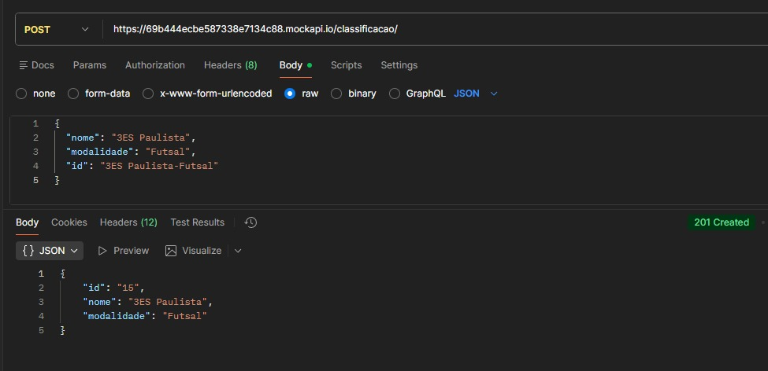
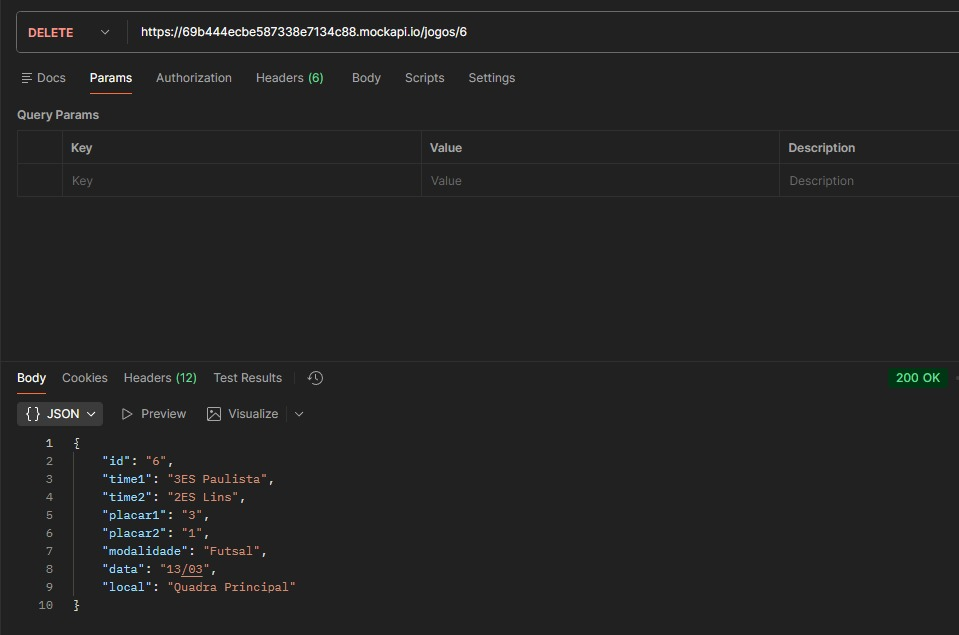
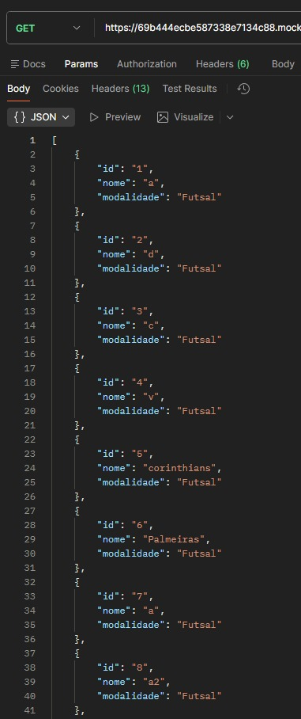
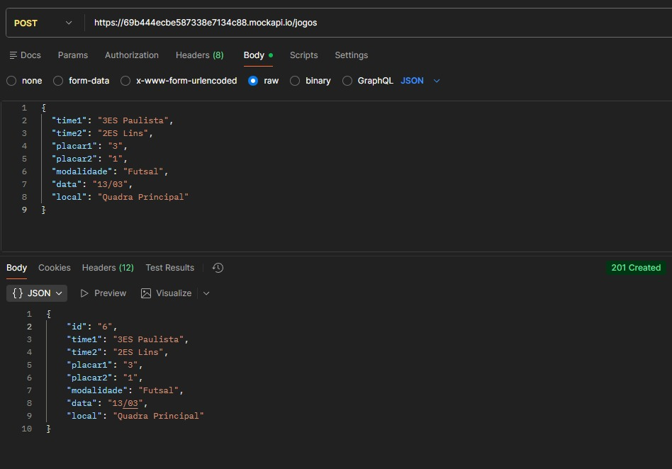

# 🏆 Interclasse Digital

Aplicativo mobile desenvolvido em React Native com Expo para gerenciar o campeonato interclasse escolar.

---

## 📱 Descrição do Aplicativo

O **Interclasse Digital** permite registrar e acompanhar jogos do campeonato interclasse entre turmas. O app oferece:

- Visualização das modalidades disponíveis (Futsal, Vôlei, Basquete e E-Sports)
- Tabela de classificação em tempo real por modalidade
- Calendário de jogos com histórico de partidas
- Cadastro de novos jogos com placar, times, data e local
- Persistência de dados com AsyncStorage
- Integração com API externa via Axios (MockAPI)

---

## 🛠️ Tecnologias Utilizadas

- React Native + Expo
- React Navigation (Bottom Tabs)
- AsyncStorage
- Axios
- MockAPI (REST API)
- Expo Vector Icons

---

## 📂 Estrutura do Projeto

```
Interclasse/
├── App.js
├── screens/
│   ├── ModalidadesScreen.js
│   ├── ClassificacaoScreen.js
│   ├── CalendarioScreen.js
│   └── CadastroJogoScreen.js
├── components/
│   └── Header.js
├── services/
│   └── api.js
├── storage/
│   ├── classificacaoStorage.js
│   └── jogosStorage.js
└── assets/
    ├── futsal.png
    ├── volei.png
    ├── basquete.png
    └── esports.png
```

---

## 🔗 API — Endpoints MockAPI

Base URL: `https://69b444ecbe587338e7134c88.mockapi.io`

| Método | Endpoint | Descrição |
|--------|----------|-----------|
| GET | `/jogos` | Lista todos os jogos |
| POST | `/jogos` | Cadastra um novo jogo |
| DELETE | `/jogos/:id` | Remove um jogo |
| GET | `/classificacao` | Lista a classificação |
| POST | `/classificacao` | Cadastra um time na classificação |

---

## 👥 Integrantes do Time

| Nome | RM |
|------|----|
| Rafael Del Padre | RM-552765 |
| Rafael de Almeida | RM-554019 |
| Giovanna | RM-553701 |
---

## 📸 Telas do Aplicativo





 
---

## 🧪 Testes de API

> Adicione aqui os prints dos testes feitos no Postman / Thunder Client / Insomnia para cada endpoint







## 🎥 Vídeo do Projeto

> Adicione aqui o link do vídeo explicativo do projeto

---
